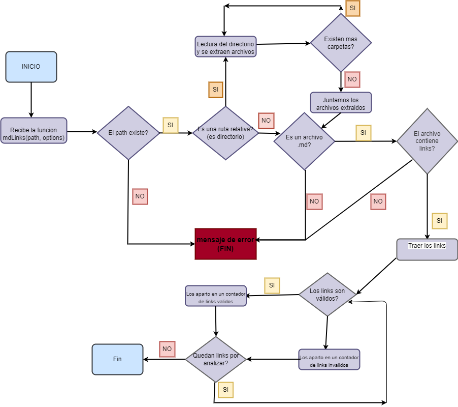
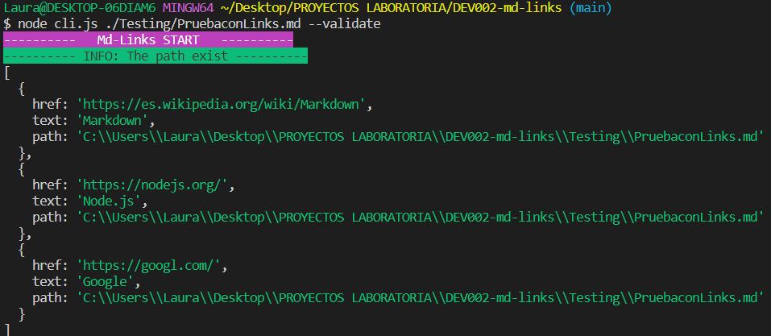
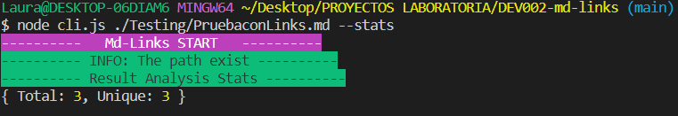
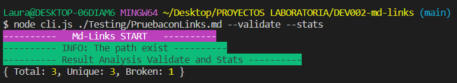

# Markdown Links

## Índice

* [1. Introducción](#1-introducción)
* [2. Objetivo del proyecto](#2-objetivo-del-proyecto)
* [3. Plan de acción](#3-plan-de-acción)
* [4. Proyecto](#4-proyecto)

***

## 1. Introducción

[Markdown](https://es.wikipedia.org/wiki/Markdown) es un lenguaje de marcado
ligero muy popular entre developers. Es usado en muchísimas plataformas que
manejan texto plano (GitHub, foros, blogs, ...) y es muy común
encontrar varios archivos en ese formato en cualquier tipo de repositorio
(empezando por el tradicional `README.md`).

Estos archivos `Markdown` normalmente contienen _links_ (vínculos/ligas) que
muchas veces están rotos o ya no son válidos y eso perjudica mucho el valor de
la información que se quiere compartir.

[Node.js](https://nodejs.org/es/) es un entorno de ejecución para JavaScript
construido con el [motor de JavaScript V8 de Chrome](https://developers.google.com/v8/).
Esto nos va a permitir ejecutar JavaScript en el entorno del sistema operativo,
ya sea tu máquina o un servidor, lo cual nos abre las puertas para poder
interactuar con el sistema en sí, archivos, redes, ...


## 2. Objetivo del proyecto

Herramienta de línea de comando (CLI) que se ejecuta con Node.js, que permite leer y analizar archivos en formato Markdown, para verificar que los links que contiene el archivo .md son válidos o se encuentra rotos. Adicional muestra estadísticas de acuerdo a los resultados de la validación.

## 3. Plan de acción

 - Se realizó un diagrama de flujo para verificar el camino que se debía ir tomando a medida que se iba construyendo el proyecto.

 

## 4. Proyecto

Este proyecto contiene los siguientes archivos:

- functions.js: Se encuentran las funciones que constituyen la funcion mdLinks.
- index.js: Se almacena la funcion mdLinks y regresa una promesa con un array de objetos.
- cli.js: Contiene la linea de comandos para ser ejecutado por la terminal.

#### `mdLinks(path, options)`

##### Argumentos

* `path`: Ruta **absoluta** o **relativa** al **archivo** o **directorio**.
Si la ruta pasada es relativa, debe resolverse como relativa al directorio
desde donde se invoca node - _current working directory_).
* `options`: Un objeto con **únicamente** la siguiente propiedad:
  - `validate`: Booleano que determina si se desea validar los links
    encontrados. 
    
  - `stats`: Booleano que determina si se desea obtener un reporte estadístico de los links
    encontrados.
    
  - Se considerara una tercera opción en caso ambos sean 'true', en la que entrega un reporte estadístico de los links
   encontrados.
   


##### Valor de retorno

La función retorna una promesa (`Promise`) que resuelve un arreglo (`Array`) de objetos (`Object`), 
donde cada objeto representa un link y contiene las siguientes propiedades

Con `validate:false` :

* `href`: URL encontrada.
* `text`: Texto que aparecía dentro del link (`<a>`).
* `file`: Ruta del archivo donde se encontró el link.

Con `validate:true` :

* `href`: URL encontrada.
* `text`: Texto que aparecía dentro del link (`<a>`).
* `file`: Ruta del archivo donde se encontró el link.
* `status`: Código de respuesta HTTP.
* `ok`: Mensaje `fail` en caso de fallo u `ok` en caso de éxito.

#### Ejemplo (resultados como comentarios)

```js
const mdLinks = require("md-links");

mdLinks("./some/example.md")
  .then(links => {
    // => [{ href, text, file }, ...]
  })
  .catch(console.error);

mdLinks("./some/example.md", { validate: true })
  .then(links => {
    // => [{ href, text, file, status, ok }, ...]
  })
  .catch(console.error);

mdLinks("./some/dir")
  .then(links => {
    // => [{ href, text, file }, ...]
  })
  .catch(console.error);
```

### CLI (Command Line Interface - Interfaz de Línea de Comando)

El ejecutable se puede llevar acabo a traves de la terminal.

`md-links <path-to-file> [options]`

Por ejemplo:

```sh
$ md-links ./some/example.md
./some/example.md http://algo.com/2/3/ Link a algo
./some/example.md https://otra-cosa.net/algun-doc.html algún doc
./some/example.md http://google.com/ Google
```

#### Options

##### `--validate`

Si pasamos la opción `--validate`, el módulo debe hacer una petición HTTP para
averiguar si el link funciona o no. Si el link resulta en una redirección a una
URL que responde ok, entonces consideraremos el link como ok.

##### `--stats`

Si pasamos la opción `--stats` el output (salida) será un texto con estadísticas
básicas sobre los links.

```sh
$ md-links ./some/example.md --stats
Total: 3
Unique: 3
```

También podemos combinar `--stats` y `--validate` para obtener estadísticas que
necesiten de los resultados de la validación.

```sh
$ md-links ./some/example.md --stats --validate
Total: 3
Unique: 3
Broken: 1
```
